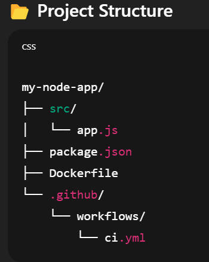
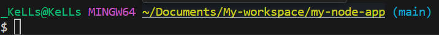
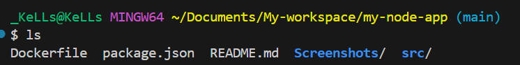
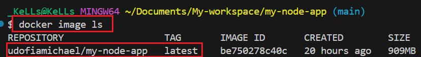
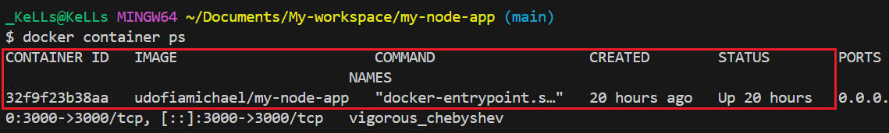
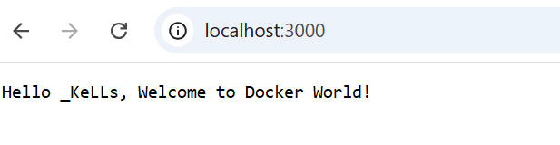
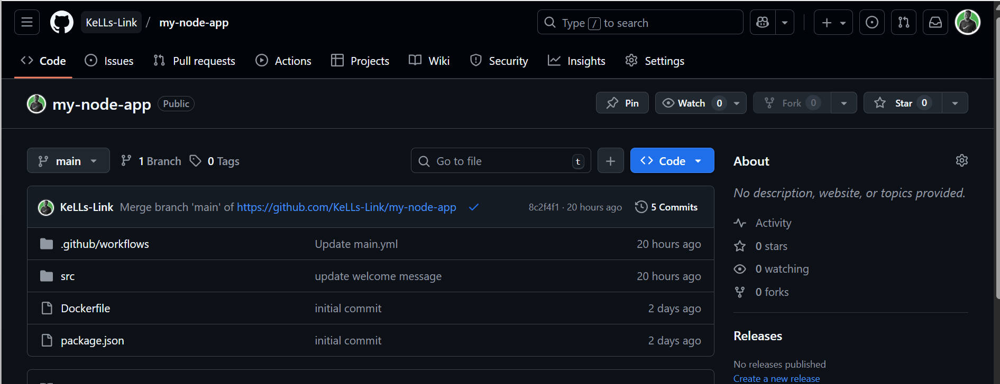
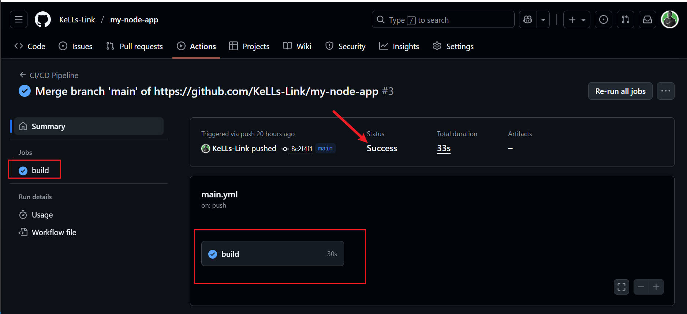
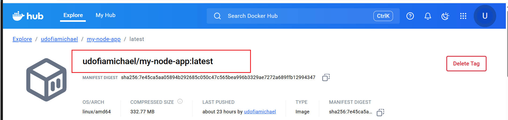

## **A Containerized Node.js Application Using GitHub Actions as CI/CD Pipeline**



### **Prepare Your Node.js Project**
- **Create a project folder:**
```
mkdir my-node-app
cd my-node-app
```


- **Initialize a Node.js project:**

```
npm init -y
```
- **Create your application file:**
```
mkdir src
echo "console.log('Hello from my app');" > src/app.js
```


- **`package.json` file with a start script**
```
{
  "name": "my-node-app",
  "version": "1.0.0",
  "description": "A simple Node.js app for Docker CI/CD demo",
  "main": "src/app.js",
  "scripts": {
    "start": "node src/app.js",
    "test": "echo \"No tests yet\" && exit 0"
  },
  "keywords": [],
  "author": "",
  "license": "ISC"
}
```

- **Create the Dockerfile: This ensures that my app runs inside a container**

**`Dockerfile`**
```
# Base image
FROM node:16

# Set working directory
WORKDIR /app

# Copy package files and install dependencies
COPY package.json ./
RUN npm install

# Copy application code
COPY . .

# Expose port
EXPOSE 3000

# Start the application
CMD ["npm", "start"]
```
- **Test Docker Locally**

Build the `Docker image`:
```
docker build -t my-node-app:latest .
```


- **Run the container:**
```
docker run -d -p 3000:3000 my-node-app:latest
```


- **Go to browser**

Open a browser and go to `http://localhost:3000` to verify it’s running.



- **Create the GitHub Actions Workflow/pipeline**

This workflow is meant to `test`, `build`, and `push` your `Docker image` whenever you push to `main`.

Create the `workflow folder`
```
mkdir -p .github/workflows
```
- Create `main.yml` in `.github/workflows/`
```
name: CI/CD Pipeline

on:
  push:
    branches:
      - main

jobs:
  build:
    runs-on: ubuntu-latest

    steps:
      - name: Checkout code
        uses: actions/checkout@v3

      - name: Log in to Docker Hub
        uses: docker/login-action@v2
        with:
          username: ${{ secrets.DOCKER_USERNAME }}
          password: ${{ secrets.DOCKER_PASSWORD }}

      - name: Build Docker image
        run: docker build -t udofiamichael/my-node-app:latest .

      - name: Run Tests
        run: npm test

      - name: Push Docker image
        run: docker push udofiamichael/my-node-app:latest

```

- **Push Workflow**

```
git add .github/workflows/main.yml
git commit -m "Add CI/CD workflow"
git push
```




- **Docker Hub Repository**
Docker image succesfully built and deployed (pushed) onto dockerhub and available on pull request.


